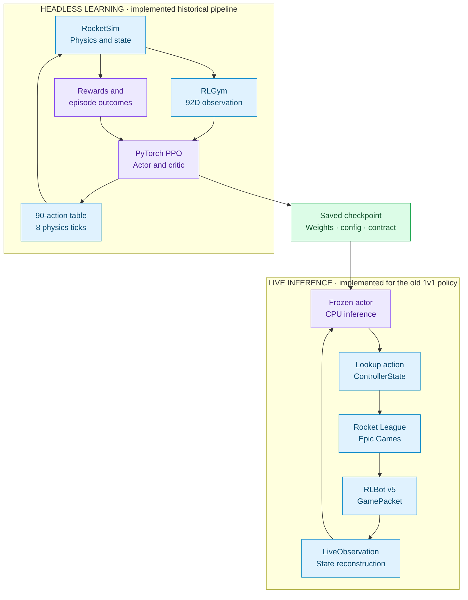
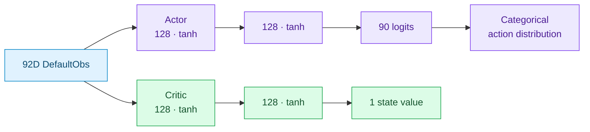
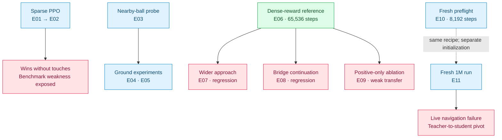
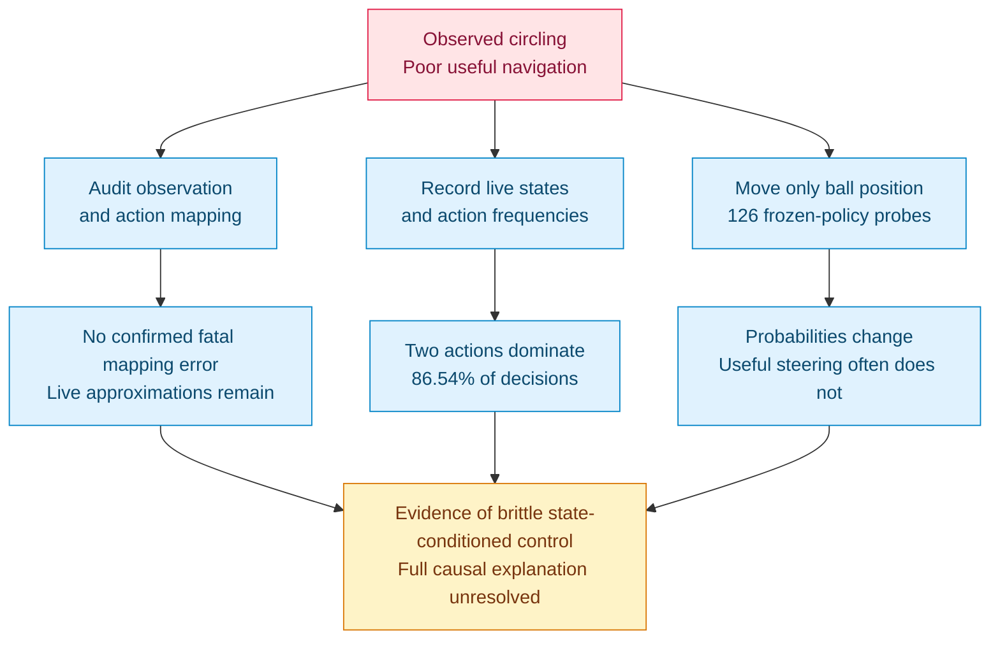
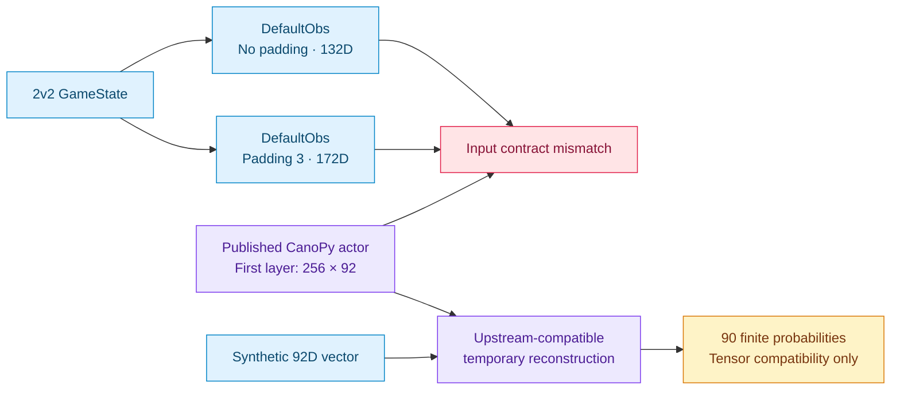
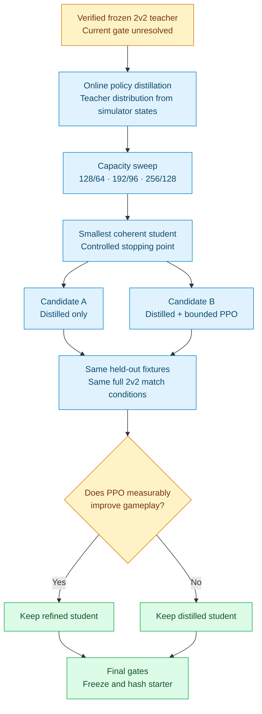
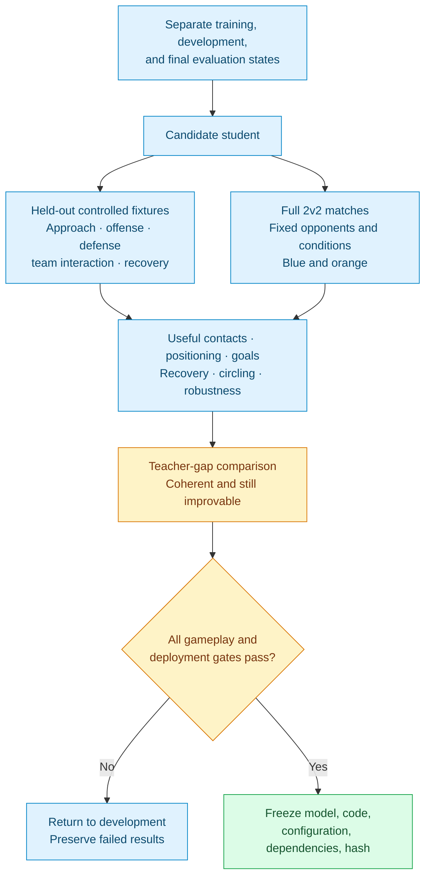

# rocket league ml bot

### Rocket League · Machine learning · An overnight student AI competition

**Build a bot that can play. Give every team the same starting point. Leave room to improve.**

Model Wars is developing a deliberately modest, genuinely ML-driven Rocket League starter for a **2v2 competition**. This repository contains the simulator and learning pipeline, eleven recorded PPO experiments, a live RLBot deployment, extensive behavioral diagnostics, and the investigation that now guides the teacher-to-student approach.

> **Project status — 4 October 2026**  
> The technical ML pipeline works, and controlled experiments demonstrated narrow contact learning. A reliable competition starter has **not** been frozen. The current teacher-to-student plan is blocked on CanoPy's published **92-input checkpoint** versus the required, verified 2v2 observation contract.

## Index

1. [What is Model Wars?](#what-is-model-wars)
2. [Current status](#current-status)
3. [Documentation and source priority](#documentation-and-source-priority)
4. [Repository map](#repository-map)
5. [How the system works](#how-the-system-works)
6. [Environment and hardware](#environment-and-hardware)
7. [The original PPO baseline](#the-original-ppo-baseline)
8. [Experiments and results](#experiments-and-results)
9. [What the 1M-step checkpoint learned](#what-the-1m-step-checkpoint-learned)
10. [Live deployment and diagnostics](#live-deployment-and-diagnostics)
11. [Why the project pivoted](#why-the-project-pivoted)
12. [CanoPy feasibility investigation](#canopy-feasibility-investigation)
13. [The planned 2v2 student](#the-planned-2v2-student)
14. [Evaluation and freeze gates](#evaluation-and-freeze-gates)
15. [Running the existing project](#running-the-existing-project)
16. [Checkpoints and reproducibility](#checkpoints-and-reproducibility)
17. [Lessons and known limitations](#lessons-and-known-limitations)
18. [Roadmap](#roadmap)
19. [Licensing and references](#licensing-and-references)

---

## What is Model Wars?

Model Wars is an overnight student AI/RL competition. Teams of **four** will receive the same pretrained starter, improve their own copy, and submit a bot for organizer-run Rocket League matches. Gameplay decisions must materially depend on a trained ML model included with the submission.

The immediate engineering objective is to build the common starting bot. It should move, orient itself, approach the ball, make useful basic contacts, recover, and show basic 2v2 positioning. It should be coherent enough to improve through experimentation while leaving clear opportunities for teams to develop better control, strategy, teamwork, and mechanics.

The final distributed bot will be a **new student model**. CanoPy is a candidate teacher, subject to verification; it is not the intended competition starter. Smaller student capacity, controlled distillation stopping, and optional bounded PPO refinement will determine the starter's strength. Random controls, disabled mechanics, or broken inference are not the planned weakening method.

Tournament packaging, validation, brackets, resource limits, sandboxing, and event operations are documented future concerns. Their implementation is **parked until the baseline is successfully built and frozen**.

## Current status

| Area | What exists | What the evidence establishes |
|---|---|---|
| Live integration | Epic Games + RLBot v5 launch path and ML-controlled example | The actor produces controllers in Rocket League |
| Headless simulation | RLGym 2.x + RocketSim, reset/step/reward lifecycle | Simulator infrastructure works |
| Learning | Local PPO, CUDA updates, checkpoint saving/loading | End-to-end training is operational |
| Behavioral evaluation | Controlled fixtures, seeded opponents, argmax/sample modes | Narrow contact improvements and transfer failures are measurable |
| Diagnostics | Contact callbacks, reward traces, live observations, sensitivity probes | Failures can be investigated beyond reward curves |
| Historical 1M policy | Frozen weights, deployed and audited | Useful learning in narrow fixtures; poor match/live play |
| CanoPy | Downloaded weights, provenance metadata, restricted loading, short probes | Tensor compatibility works; exact 2v2 teacher inference is unresolved |
| 2v2 student | Capacity sweep and distillation design | Planned; no implementation or training completed |
| Accepted starter | No checkpoint has passed promotion | **Not ready** |

The **2 October 2026 historical inventory** contains **11 training runs, 58 checkpoint files, 82 ordinary evaluation reports, and 16 detailed contact reports**. These counts describe saved artifacts, not independently successful models. The 4 October CanoPy downloads are recorded separately and are not additional Model Wars training runs.

**Next actionable gate:** obtain CanoPy's matching 2v2 checkpoint and exact source/configuration, or verify another suitable permissively licensed teacher. Starting a student run before that gate would use an unverified teaching signal.

## Documentation and source priority

This README is the project overview. The underlying documents preserve decisions and evidence in greater detail.

| Read | Document | Purpose |
|---|---|---|
| **First** | [MODEL_WARS_DECISION_LOG.md](MODEL_WARS_DECISION_LOG.md) | Current decisions, baseline-first priorities, and intended trajectory |
| **Second** | [update.md](update.md) | Complete implementation history, experiment ledger, results, failures, and artifact inventories |
| **Verify against** | [Training code](training/), [saved logs](training/logs/), [checkpoints](training/checkpoints/), [reports](training/reports/) | What actually exists and the evidence behind reported behavior |
| Teacher investigation | [CanoPy Feasibility Report](training/reports/canopy_investigation_20261004_013501/CANOPY_FEASIBILITY_REPORT.md) | Exact checkpoint inspection, sources, compatibility findings, and blocker |
| Component reference | [training/README.md](training/README.md) | Training scripts and older experiment instructions |
| Live shell reference | [python-example/README.md](python-example/README.md) | Upstream example setup and packaging notes |

The decision log contains earlier BC/offline-distillation language alongside the later online-distillation track. The latest baseline direction is **online policy distillation**, with hard-label BC as a fallback for reliable teacher actions whose probabilities cannot be recovered. Historical scripted-teacher proposals in [TEACHER_TASK.md](TEACHER_TASK.md), older curriculum notes, and stale component README paragraphs do not override that direction or the latest completed results.

## Repository map

```text
model wars/
├── README.md                         Project overview and navigation
├── MODEL_WARS_DECISION_LOG.md         Current decisions and intended trajectory
├── update.md                         Complete project history and evidence index
├── TEACHER_TASK.md                   Historical scripted-teacher specification
├── training/
│   ├── requirements.txt              Recorded ML/simulator dependencies
│   ├── config.py                     Historical PPO defaults
│   ├── environment.py                1v1 environments, fixtures, opponents, metrics
│   ├── observations/                 Original 92D DefaultObs contract
│   ├── policies/                     Original actor and critic
│   ├── rewards/                      Reward definitions and experimental terms
│   ├── ppo.py                        PPO and GAE implementation
│   ├── train.py                      Training entry point
│   ├── checkpoint.py                 Save/load with contract checks
│   ├── evaluate.py                   Seeded behavioral evaluation
│   ├── contact_diagnostics.py        Contact-time ground/air analysis
│   ├── diagnose_steps.py             Per-action reward and motion traces
│   ├── policy_ball_sensitivity.py    Frozen-policy ball-position interventions
│   ├── smoke_test.py                 Headless simulator checks
│   ├── reward_test.py                Controlled reward checks
│   ├── gpu_test.py                   CUDA checks
│   ├── test_*.py                     Focused regression checks
│   ├── checkpoints/                  Preserved experiment weights
│   ├── logs/                         Configs, CSV metrics, JSON evaluations
│   ├── reports/                      Research and CanoPy investigation
│   └── venv/                         Dedicated training environment
├── python-example/
│   ├── run.py                        Existing RLBot launcher
│   ├── rlbot.toml                    Epic Games match/launcher configuration
│   ├── src/bot.py                    MyBot, controlled by the frozen ML actor
│   ├── src/ml_policy.py              Inference and live-state adapter
│   ├── src/observation_diagnostics.py Live logging and contract diagnostics
│   ├── logs/                        Saved live diagnostic evidence
│   └── venv/                        Dedicated RLBot environment
└── venv/                            Older root environment
```

The working training and live environments are separate. The root `venv/` is not the designated training environment. The current live adapter imports the established training packages locally; portable participant packaging has not been built.

[↑ Back to index](#index)

---

## How the system works

The implemented pipeline has two connected parts: learning in a headless simulator and inference in the real game. Saved weights connect the two.



Simulation is CPU-side. PPO tensor operations use CUDA. Live inference loads the policy once, runs in evaluation mode without gradients, and holds each selected controller between decisions. No optimizer or RocketSim world runs inside the live gameplay path.

The current local policy implementation is designed around **1v1**. The planned competition is **2v2**, so the existing environment and deployment must not be described as an already-working 2v2 student system. In particular, `MyBot.get_output()` currently requires exactly two players.

## Environment and hardware

### Verified development stack

| Component | Recorded version |
|---|---|
| Operating system | Windows 11 |
| Python | 3.12.10 |
| rlgym | 2.0.1 |
| rlgym-api | 2.0.0 |
| rlgym-rocket-league | 2.0.1 |
| RocketSim | 2.2.1 |
| NumPy | 1.26.4 |
| cmeel | 0.61.0 |
| PyTorch | 2.11.0+cu128 |
| Live RLBot | 2.0.0b55 |
| Live rlbot_flatbuffers | 0.19.0 |
| Live psutil | 7.2.2 |

Training dependency pins are in [training/requirements.txt](training/requirements.txt). The ML versions above were also queried during the CanoPy investigation; the live package versions are from the recorded live setup.

Development hardware is a Lenovo LOQ with an Intel i7 HX, an RTX 4050 Laptop GPU, 24 GB RAM, and a 512 GB SSD. GPU diagnostics measured approximately **6 GiB VRAM**. Capacity planning should use that measurement.

CUDA testing confirmed available GPU execution and CPU/GPU matrix-multiplication agreement. The PyTorch build bundles CUDA 12.8; historical driver diagnostics reported support for CUDA 13.0. Driver capability and the framework's bundled runtime are separate version numbers. A separate CUDA toolkit was not required for the recorded setup.

### Runtime caveats

The RocketSim wheel's filename and internal platform tag disagree under Python 3.12, so `pip check` reports it as unsupported even though import and simulator checks passed. This remains a reproducibility caveat. The four simulator instances used in historical experiments run serially inside one process; multiprocessing workers were discussed but never implemented.

The known-good live launch uses **Epic Games**, not Steam. Python 3.11 failed on `typing.override`; the live venv was rebuilt with Python 3.12. The server address is `127.0.0.1:23234`, and the recorded launcher configuration preserves the established RLBot v5 path.

## The original PPO baseline

### Observation and action contract

| Property | Implemented historical contract |
|---|---|
| Game mode | 1v1 |
| Observation | RLGym DefaultObs, unpadded, 92D |
| Preprocessing | Cast to float32; finite/shape checks |
| Actions | RLGym LookupTableAction, 90 choices |
| Controller fields | throttle, steer, pitch, yaw, roll, jump, boost, handbrake |
| Action repeat | 8 physics ticks |
| Physics rate | 120 ticks/s; nominally 15 decisions/s |
| Simulator control delay | `rlbot_delay=True` |

The observation uses team-oriented world physics, boost-pad timers, own jump/flip state, and car-state fields. Positions and linear velocities use `/2300`, angular velocities `/pi`, boost `/100`, and boost-pad timers `/10`. It has no explicit car-local ball-left/forward feature. Orange observations use team inversion. The exact implementation lives in [observations](training/observations/__init__.py) and [environment.py](training/environment.py).

### Network and optimizer



Actor and critic are separate networks, with **68,571 parameters in total**. Common defaults were seed 42, four environments, 256 rollout steps per environment, learning rate `3e-4`, discount `0.99`, GAE lambda `0.95`, PPO clip `0.2`, four epochs, minibatches of 256, entropy coefficient `0.01`, value coefficient `0.5`, gradient clipping `0.5`, and approximate-KL stopping target `0.03`.

[ppo.py](training/ppo.py) implements GAE, normalized advantages, timeout bootstrapping, reset boundaries, and finite loss/gradient checks. Goals terminate with no value bootstrap; timeouts bootstrap from the final observation before reset. **Rewards and returns are not normalized**, so critic loss scales cannot be compared blindly between reward recipes.

This remains useful experimental infrastructure. Cold-start PPO is no longer the primary method for creating the starter.

[↑ Back to index](#index)

---

## Experiments and results

All eleven recorded learning runs below used the historical 1v1 pipeline. Step ranges are cumulative learner transitions for that run or resumed branch. A saved checkpoint does not imply a separate behavioral evaluation.

| ID | Run | Steps | What we tried | Result and interpretation |
|---|---|---:|---|---|
| E01 | [ppo_smoke](training/logs/ppo_smoke/) | 0 → 4,096 | Sparse goal/touch PPO; one environment | Saving/loading and updates worked. Four wins in ten games, **zero learner touches**; no useful ball-control evidence. |
| E02 | [ppo_scale](training/logs/ppo_scale/) | 4,096 → 69,632 | Resume sparse PPO with four environments | Five wins in twenty games, all without learner touch. Opponent outcomes made win rate misleading. |
| E03 | [touch_probe](training/logs/touch_probe/) | 0 → 65,536 | Nearby stationary ball; all 90 actions | Argmax touch rate reached **95% / 97.5%** on two seeds, but sampled rate was **0%**; kickoff-v2 transfer failed. |
| E04 | [ground_probe_v1](training/logs/ground_probe_v1/) | 0 → 32,768 | Mask aerial actions; retain 90 actor outputs | Sample touch rate fell **52.5% → 12.5%**; argmax remained 0%. Ground masking did not teach reliable driving. |
| E05 | [ground_approach_v1](training/logs/ground_approach_v1/) | 0 → 32,768 | Ground mask + signed approach shaping | Final rollout recorded zero touches; no standalone saved behavioral evaluation. Improvement cannot be claimed. |
| E06 | [early_reward_probe_v1](training/logs/early_reward_probe_v1/) | 0 → 65,536 | Dense touch/approach/facing/air shaping | Argmax close-ball touch rate **87.5%** on both seeds, with grounded contact evidence. Wider approach remained brittle. Preserved as a reference. |
| E07 | [approach_stage2_v1](training/logs/approach_stage2_v1/) | 65,536 → 196,608 | Resume E06 on wider starts | Shaped reward improved, but final argmax touch rate collapsed to **0%**. Action 52 dominated. |
| E08 | [bridge_stage2_v1](training/logs/bridge_stage2_v1/) | 65,536 → 98,304 | Resume E06 on gentler bridge starts | Argmax contact collapsed to **0%** on tested bridge and close-ball sets. Action 38 dominated. |
| E09 | [bridge_positive_reward_v1](training/logs/bridge_positive_reward_v1/) | 65,536 → 98,304 | Clip negative approach reward to zero | Avoided complete argmax inactivity, but bridge contact was only **35% / 22.5%**, with 0% ground proxy; did not replace E06. |
| E10 | [guide_early_preflight_v1](training/logs/guide_early_preflight_v1/) | 0 → 8,192 | Conventional early-reward recipe | Short run completed with finite losses. No standalone behavioral evaluation; no skill claim. |
| E11 | [guide_early_1m_v1](training/logs/guide_early_1m_v1/) | 0 → 1,000,000 | Fresh policy; conventional shaping on bridge starts | Better held-out contact rates, but mostly airborne contacts, **zero kickoff-v2 learner touches**, and poor live navigation. |

The experiments form several branches; E11 was a **fresh run**, not a resume of E06 or E10.



### The controlled fixtures

| Fixture | Initial task | Scope |
|---|---|---|
| `touch` | Ball roughly 550 units ahead, small lateral variation | Nearby-ball diagnostic; distant idle opponent |
| `bridge` | Distance 550–1100, lateral offset up to 300, heading variation up to 0.3 rad | Gentler transfer diagnostic; idle opponent |
| `approach` | Distance 900–1700, lateral offset up to 600, heading variation up to 0.65 rad | Wider navigation diagnostic; idle opponent |
| `kickoff` | Standard kickoff against scripted v1 or v2 | Interaction benchmark; short sudden-death episodes |

Most later comparisons use 40 episodes, alternating blue/orange learner sides and separate fixture/action seeds. The v1 and v2 opponents are different benchmarks; their win rates are not interchangeable. These tests are not full five-minute 2v2 matches.

### Reward experiments and what they taught us

The sparse recipe was `10 * GoalReward + 0.1 * TouchReward`. E06 instead used goal 0, touch 1, signed approach 0.02, speed-gated facing 0.01, and air 0.001. It produced a narrow grounded contact maneuver: close-task argmax mean touches were **1.550 / 1.475**, with first touch around **0.67 seconds** and substantial goalward ball movement. On wider approach seed 3000, argmax touch rate improved only **10% → 17.5%**.

The approach term measured displacement toward the previous ball position. It was not the later instantaneous velocity-to-ball reward. E07/E08 improved shaped reward while losing deterministic contacts. E09 removed negative approach values but still failed to recover E06's grounded behavior.

Per-step traces exposed how a candidate could earn approach reward without useful commanded propulsion: **145 of 200** positive intervals had neither throttle nor boost; **144** of those were airborne. This is a command proxy, not proof of passive coasting. Fixed-trajectory counterfactual scoring tested first-touch gating and other terms, but **no first-touch-gated training run exists**.

The guide recipe used for E10/E11 was:

| Term | Weight |
|---|---:|
| TouchReward | 50 |
| SpeedTowardBallReward | 5 |
| GuideFaceBallReward, orientation only | 1 |
| InAirReward | 0.15 |
| GoalReward | 0 |

The velocity reward was implemented locally from the documented tutorial formula because the installed reward package did not ship it. Its definition differs from the earlier displacement reward. Larger shaping weights also increased raw critic-loss scale.

Complete checkpoint coverage, seeds, metrics, and individual report filenames are preserved in [update.md](update.md), including its four appendices.

## What the 1M-step checkpoint learned

E11 saved 32 checkpoint files, including initial, periodic, and final weights. Training rolling reward rose from **49.03** at 1,024 steps to **208.99** at 1M, while entropy fell from **4.499** to **2.649**. Final approximate KL was **0.000833**, and cumulative throughput was approximately **559 transitions/s**. These optimizer metrics describe the run; gameplay evidence comes from evaluation.

### Paired held-out contact results

Each row below compares the initial and final policy on the same fixture seed and mode, with 40 episodes. Touch rate means the fraction of episodes with at least one learner touch step.

| Fixture | Mode | Touch rate: initial → 1M | Mean touches: initial → 1M | Mean goalward ball progress: initial → 1M |
|---|---|---:|---:|---:|
| Bridge, seed 7000 | Argmax | 5% → **65%** | 0.050 → 0.825 | 235 → 1,131 units |
| Bridge, seed 7000 | Sample | 17.5% → **47.5%** | 0.175 → 0.750 | 596 → 1,332 units |
| Bridge, seed 8000 | Argmax | 2.5% → **65%** | 0.025 → 0.875 | 113 → 903 units |
| Bridge, seed 8000 | Sample | 20% → **62.5%** | 0.200 → 0.900 | 793 → 1,176 units |
| Touch, seed 3000 | Argmax | 0% → **37.5%** | 0 → 0.375 | 0 → 923 units |
| Touch, seed 3000 | Sample | 27.5% → **55%** | 0.300 → 0.875 | 970 → 1,457 units |

These results show transferable contact learning within controlled reset distributions. Ball progress includes physics and opponent effects and is not a causal measure of learner shot quality.

### Where it failed

On the harder approach fixture, seed 9000, final touch rates were **10% argmax** and **35% sampled**. Ground-contact proxies remained 0%.

Against kickoff opponent v2, the final policy recorded:

| Metric | Recorded result |
|---|---:|
| Games | 20 |
| Wins / losses / draws | **0 / 20 / 0** |
| Learner touches | **0** |
| Opponent first-touch rate | **100%** |
| Goals for / against | **0 / 20** |
| Mean episode duration | 4.75 seconds |

Source: [saved kickoff-v2 report](training/logs/guide_early_1m_v1/eval_kickoff_v2_seed9000_argmax_step1000000.json).

### Contact posture matters

[contact_diagnostics.py](training/contact_diagnostics.py) classifies wheel contact at the actual RocketSim contact event. This differs from the older evaluator's conservative requirement that the car be grounded at both action boundaries.

At 1M, argmax ground-touch episode rates were **10% on bridge 7000**, **12.5% on bridge 8000**, **0% on touch 3000**, and **7.5% on approach 3000**. Airborne contacts accounted for **72–100%** of raw contacts in those argmax reports. Ground and air episode sets can overlap; raw contacts and rewarded touch steps have different denominators.

Historical startup analysis found initial throttle/boost and closing velocity, followed by very early jumps. Some sequence aggregates were reported in the project discussion without a separate summary JSON. They support the account in [update.md](update.md), but should not be presented as an independently rerun diagnostic.

**The measured achievement is improved contact behavior. Reliable sustained ground control and useful match play remained unproven.**

## Live deployment and diagnostics

### The integration that worked

The original official Python example successfully launched Rocket League through Epic before ML training was introduced. The existing shell was later connected to the frozen 1M actor through [src/ml_policy.py](python-example/src/ml_policy.py), with `MyBot` in [src/bot.py](python-example/src/bot.py).

The adapter builds a RLGym-style state from RLBot packets, calls the original observation builder, performs CPU inference, converts the lookup row into `ControllerState`, and selects a new action every eight physics frames. Recorded inference was approximately **0.3–0.6 ms**. Gameplay decisions came from the actor; no scripted ball-chasing fallback was inserted.

### The behavior that did not work

The user observed roughly five minutes of poor useful navigation: acceleration and repetitive turning/circling, barely any ball interaction, and unreliable approach even when the ball was moved nearby. Physical disruption could change the action regime, but normal ground states often returned to a hard-left cycle.

The later continuous recording contains **14,646 decisions**, including **14,370 active-play decisions**, with no recorded policy errors. Actions **51 and 12 accounted for 86.54%** of all decisions. The stream was approximately **89.8% grounded**, showing that frequent poor steering was not confined to airborne states. The full recording extends beyond the period the user explicitly reported watching.

### Contract audits and their limits

| Investigation | Finding | Limit |
|---|---|---|
| Numeric action/controller audit | All 90 table rows agreed | Does not establish policy quality |
| Synthetic team mirror | All 92 features matched within about `8.74e-8` | Synthetic parity is not complete real-packet parity |
| Feature/scaling review | No confirmed fatal ordering, inversion, or control-sign mismatch | Timer/handbrake/ground-state approximations remain |
| Continuous JSONL recording | Controllers and state/action regimes captured during play | Historical streams retain diagnostic-label caveats |
| Diagnostic lateral-sign correction | Driver-right was mislabeled by negating `PhysicsObject.right` | The erroneous sign was not used in model observations or controllers |

Logs flush continuously and rotate at roughly 64 MiB. This preserves evidence while a match is running, including games with unlimited overtime.

### Frozen-policy ball sensitivity

The [sensitivity probe](training/policy_ball_sensitivity.py) evaluated **126 interventions**: seven fixed state templates, six ball directions, and three distances. Only ball-position slots 0–2 changed; all other features and checkpoint hashes were preserved.

Probabilities did respond to the ball. In the stationary blue case, paired left/right mean total-variation distance was approximately **0.244**, with maximum **0.582**. Nevertheless, many cases selected the same action, no tested case selected positive steer, and one recorded ground regime retained strongly negative expected steering.



The policy is **not literally ball-position insensitive**. The evidence instead supports a failure to translate changed geometry into useful control. These fixed-state interventions do not prove rollout behavior across every possible state. Source: [saved sensitivity report](training/logs/guide_early_1m_v1/policy_sensitivity/ball_sensitivity_001.json).

[↑ Back to index](#index)

---

## Why the project pivoted

Cold-start PPO produced useful experimental evidence, but the resulting policy did not meet the starter's navigation and gameplay requirements. The project therefore moved toward transferring already-coherent behavior from a verified teacher into a smaller student.

Several ideas were explored before the current direction was selected:

| Idea | Recorded status |
|---|---|
| Continue cold-start PPO as the main baseline method | Rejected as the current primary path; old experiments preserved |
| Use a simple scripted teacher, then offline BC | Historical design proposal; no teacher dataset or BC training completed |
| Use relative observations | Candidate inspected; not adopted or used to train an existing checkpoint |
| Public replay/dataset pretraining | Considered; separate dataset investigation canceled, with no dataset downloaded/converted |
| Use Nexto/Necto as teacher | Deferred unless separate permission/license clearance is obtained |
| Use CanoPy as a permissive teacher candidate | Selected for feasibility investigation; not yet technically verified |
| Distill online into a small 2v2 student | Current intended method, pending teacher validation |

The planned change is from **random policy learning basic control through reward** to **a student learning coherent behavior from a verified teacher**, with PPO reserved for measured refinement. The final model's usefulness must still be demonstrated in closed-loop play.

## CanoPy feasibility investigation

### What was inspected

On 4 October, the complete [published CanoPy repository](https://huggingface.co/FlameF0X/CanoPy) was downloaded at revision:

```text
c171a3f6235d134556ff315c087bbea60056d727
```

It contains the actor, critic, both optimizers, a bookkeeping JSON, a README, and `.gitattributes`. File sizes and all four checkpoint SHA-256 hashes matched the saved Hugging Face metadata. An initial hashing command accidentally included its own output CSV; independent verification subsequently confirmed the downloads were intact.

Inspection checked archive members and pickle opcodes before loading with `weights_only=True`. All four checkpoints loaded in the existing PyTorch environment without unrestricted deserialization or custom allowlists. These checks reduce risk but do not certify arbitrary checkpoint files as universally safe.

### The decisive mismatch

The actor tensors define **92 → 256 → 128 → 90**, with **68,314 parameters**. The critic also accepts 92 inputs. Specifically, the actor's `model.0.weight` has shape **`[256,92]`**.

| Observation | Installed RLGym result | Published actor accepts it? |
|---|---:|---|
| Unpadded 1v1 | 92D | Shape fits; exact teacher semantics still unverified |
| Unpadded 2v2 | 132D | **No** |
| 2v2 padded to three cars per team | 172D | **No** |



Under an upstream-compatible ReLU/Softmax reconstruction, strict loading succeeded and a zero 92D vector produced 90 finite probabilities summing to approximately 1. Extracted logits reproduced those probabilities through Softmax. Inputs of 132D and 172D failed matrix multiplication.

The publication does not include the exact observation-builder instantiation, policy source, version lock, action table, control-delay configuration, or reference inference outputs. Its declared 2v2 setup cannot therefore be reconciled with the export by assumption. **A 92D input layer does not prove that these weights were trained in 1v1.** It proves the input requirement, not the feature meaning or training game mode.

### Other findings

- The model README declares Apache-2.0, but weight-specific ownership and third-party initialization provenance were not independently established.
- `BOOK_KEEPING_VARS.json` records **19,000,020 timesteps**, **114 model updates**, and epoch 18. Both optimizers record step 114. The README's 1B-step training setting does not establish a completed 1B-step checkpoint.
- No `config.json`, training/inference source, requirements lock, license file, or evaluation report is present in the inspected revision, despite README references to configuration and evaluation code.
- Reward running statistics are present; observation statistics are not. The README says observation standardization was disabled, but unpublished preprocessing remains unknown.
- The actor does not need the optimizer, critic, or reward statistics for a forward pass. Our local checkpoint loader nevertheless cannot load this bare state dictionary directly because it expects our own wrapper and tanh architecture.

**Verdict: C. NO for the currently published artifact as a verified frozen 2v2 teacher.** Tensor loading and 90-output extraction are feasible; exact 2v2 inference is blocked. No CanoPy 2v2 gameplay evaluation or live deployment was performed.

The smallest next step is to obtain the matching 2v2 export and complete contract from the publisher. If that cannot be obtained, investigate another source-verifiable permissive teacher. Hard-label BC cannot repair missing observation semantics; it only helps when reliable teacher actions exist but probabilities cannot be recovered.

Evidence: [full feasibility report](training/reports/canopy_investigation_20261004_013501/CANOPY_FEASIBILITY_REPORT.md), [checkpoint inspection](training/reports/canopy_investigation_20261004_013501/checkpoint_inspection.json), [repository metadata](training/reports/canopy_investigation_20261004_013501/repository_metadata.json), and [bookkeeping](training/reports/canopy_investigation_20261004_013501/model/BOOK_KEEPING_VARS.json).

## The planned 2v2 student

**This section describes future work, not a trained model.** The teacher must first pass observation, action, inference, provenance, and gameplay checks.



### Capacity sweep

The planned padded observation contract is 172D, with a shared 90-action lookup table and repeat 8. Its match to the teacher must still be verified; the CanoPy investigation did not establish that match.

| Candidate | Planned layer widths | Selection intent |
|---|---|---|
| A | `172 → 128 → 64 → 90` | Start with the smallest capacity |
| B | `172 → 192 → 96 → 90` | Intermediate capacity |
| C | `172 → 256 → 128 → 90` | Larger comparison candidate |

Choose the smallest architecture that remains coherent and stable. Teacher agreement and distribution divergence are useful diagnostics, but actual approach, useful contacts, recovery, teammate behavior, robustness, and inference cost determine acceptance.

### Distillation and strength control

Online distillation is the default: use a frozen teacher to supervise the student directly from simulator states. A huge permanent offline dataset is not the planned starting point. Hard-label BC remains a fallback if the exact probability distribution cannot be recovered from an otherwise reliable teacher.

Stop distillation once the student reaches the intended starter quality. Smaller capacity alone may not ensure a weak starter if training continues to full convergence. PPO is a separate bounded experiment, retained only when paired evaluation demonstrates a useful improvement without erasing the intended teacher gap. No exact distillation stopping threshold or PPO refinement budget has been frozen.

[↑ Back to index](#index)

---

## Evaluation and freeze gates

The project requires both **held-out controlled fixtures** and **full 2v2 matches**. The old 1v1 diagnostic suite provides measurement infrastructure; it does not satisfy the planned 2v2 freeze gate.



Planned fixtures cover straight/angled approach, moving balls, open-goal offense, corner clears, own-goal defense, opponent possession, teammate challenges, low boost, awkward orientation, airborne recovery, and wall-adjacent states. Final fixtures must be held out from training and kept separate from development tests.

Distilled-only and PPO-refined candidates must use the same seeds and match conditions. Goal outcomes, useful ball progression, teammate positioning, recovery, and circling matter alongside contact frequency. Final acceptance also requires stable live deployment and the exact frozen starter artifact.

### Reading the existing metrics correctly

| Metric | Meaning | Important limit |
|---|---|---|
| Touch episode rate | Episodes with at least one learner touch step | Different from mean touch count |
| Mean touches | Rewarded touch intervals per episode | Multiple physical callbacks can occur in one interval |
| Raw contacts | RocketSim contact callbacks | Different denominator from rewarded touches |
| Ground proxy | Grounded at both interval boundaries and touched | Conservative; can miss a ground hit followed by bounce |
| Contact-time posture | Wheel state at actual collision | Ground/air episode sets can overlap |
| First-touch time | Time until first learner touch, among touching episodes | Conditional on success; missing when there are no touches |
| Ball progress | Signed episode displacement toward opponent goal | Not proof of useful learner-caused contact |
| Win rate | Outcomes against the selected opponent | Can be inflated by wins without learner interaction |
| Reward | Sum under that run's reward recipe | Different recipes and scales are not directly comparable |

## Running the existing project

The commands below are for the **already-configured Windows workspace**, run from the repository root unless stated otherwise. They are not a fresh-install guarantee or a way to launch the planned 2v2 student. Downloads, long evaluations, and training are run by the user in their own terminal.

### Inspect the entry points

```powershell
& '.\training\venv\Scripts\python.exe' '.\training\train.py' --help
& '.\training\venv\Scripts\python.exe' '.\training\evaluate.py' --help
```

### Check simulator, rewards, and CUDA

These are infrastructure diagnostics, not training runs:

```powershell
& '.\training\venv\Scripts\python.exe' '.\training\smoke_test.py'
& '.\training\venv\Scripts\python.exe' '.\training\reward_test.py'
& '.\training\venv\Scripts\python.exe' '.\training\gpu_test.py'
```

### Evaluate a preserved historical checkpoint

This explicitly uses the old 1v1 bridge fixture. It writes a new report; it does not train or update the model.

```powershell
& '.\training\venv\Scripts\python.exe' '.\training\evaluate.py' `
    --model '.\training\checkpoints\guide_early_1m_v1\baseline_step_1000000.pt' `
    --scenario bridge --seconds 10 --games 40 `
    --seed 7000 --action-seed 3000 --mode argmax `
    --output '.\training\logs\guide_early_1m_v1\readme_bridge_seed7000_argmax.json'
```

For a sampled comparison, change `--mode` to `sample` and use a distinct output filename. Existing output names are preserved by the evaluator's numbering logic. Same-machine seeded comparisons are supported; cross-platform bit-identical physics is not promised.

### Check the live adapter without starting a match

```powershell
& '.\python-example\venv\Scripts\python.exe' '.\python-example\src\bot.py' --self-test
```

The self-test checks local model/adapter/controller integration. It is not a full simulator-to-live equivalence proof.

### Launch the historical live bot

This opens the real game through the established Epic/RLBot configuration:

```powershell
Set-Location '.\python-example'
& '.\venv\Scripts\python.exe' '.\run.py'
```

The current live bot uses the frozen 1M **1v1** checkpoint, defaults to argmax, and retains the two-player guard. Its known poor gameplay is documented above. The training venv and checkpoint must exist because the adapter imports local training packages. No participant installer or portable standalone starter release exists yet.

Historical training commands remain in the component documentation and source CLI. Another cold-start PPO run is not the current baseline plan.

## Checkpoints and reproducibility

### Key preserved artifacts

| Artifact | Role |
|---|---|
| [E06 step 65,536](training/checkpoints/early_reward_probe_v1/baseline_step_65536.pt) | Historical grounded close-contact reference |
| [E11 step 1,000,000](training/checkpoints/guide_early_1m_v1/baseline_step_1000000.pt) | Frozen historical policy used in live diagnostics |
| [E11 evaluations](training/logs/guide_early_1m_v1/) | Held-out fixture and failed kickoff evidence |
| [Contact diagnostics](training/logs/guide_early_1m_v1/contact_diagnostics/) | Sixteen contact-time reports |
| [Live observation diagnostics](python-example/logs/observation_diagnostics/) | Feature/action audits, synthetic cases, JSONL streams |
| [CanoPy investigation](training/reports/canopy_investigation_20261004_013501/) | Downloaded teacher candidate and feasibility evidence |

<details>
<summary><strong>Exact SHA-256 values for the three key actors</strong></summary>

| Artifact | SHA-256 |
|---|---|
| E06 reference | `484499AD7EFF3EA944E5E93A321C24E58BBA4C02392715DEDADF0D142F9939EF` |
| E11 frozen 1M policy | `f1a6b40950f79045a7a13d50c6a38935834e83dd4ad5c9333120338bed0d7281` |
| Published CanoPy actor | `54162458cc17b8e21530befd717796c41b41a58545b9fafd5bfd10f6fbc4208c` |

</details>

Our checkpoint format stores model/optimizer state, configuration, cumulative steps, package versions, and the observation/action contract. Loading uses `weights_only=True` and checks compatibility. Run names and report handling protect prior evidence from silent replacement.

Resuming restores saved learning state but starts fresh simulator episodes and seeded RNG streams. It is not a bit-exact continuation of a saved physics world. `--steps` counts learner transitions; each represents eight physics ticks. With multiple environments, the requested count may round to a multiple of the environment count.

Each run's `config.json`, `metrics.csv`, checkpoint files, and evaluation JSON should be read together. Missing evaluation coverage stays missing. Numbered repeat reports and periodic checkpoints do not become independent successful experiments merely because more files exist.

**A frozen historical checkpoint is not an accepted competition baseline.** No `baseline.pt` has passed the organizer promotion gate.

[↑ Back to index](#index)

---

## Lessons and known limitations

The experiments changed how the project measures progress:

1. **Interaction precedes a useful win-rate claim.** Early policies won without touching the ball, and even random actions looked successful against the original opponent.
2. **Reward improvements need behavioral confirmation.** Approach/bridge continuations earned more shaped reward while losing useful argmax contacts.
3. **Argmax and sampling are different behaviors.** The touch probe reached 95–97.5% argmax contact and 0% sampled contact on the same fixture families.
4. **Contact quality matters.** Frequent airborne collisions did not establish coherent driving, defense, or 2v2 positioning.
5. **Feature semantics matter beyond dimension.** A 92D teacher tensor and a 92D local vector are not automatically compatible; the CanoPy mismatch makes this concrete.
6. **Deployment success is a technical milestone.** Fast inference and valid controllers still produced poor live play.
7. **Diagnostics need their own validation.** The driver-right labeling mistake was real, but it was separate from the ML observation/controller path.
8. **Preserve negative evidence.** Failed runs, original checkpoints, incomplete coverage, and untrained proposals remain traceable.

Outstanding limitations include the unresolved teacher contract, live approximations for timers/handbrake/ground state, no accepted 2v2 student, no full 2v2 baseline evaluations, no implemented multiprocessing, and no portable participant artifact.

One historical throughput profile measured approximately **862 transitions/s** for a single disposable rollout/update, split across inference (**38.5%**), simulation (**24.5%**), and PPO update (**35.3%**). It was not a training run, was not purely a zero-gradient diagnostic, and is not a guaranteed sustained throughput. Source: [saved profiling report](training/logs/profiling/bridge_4env_1024transitions.json).

Focused regression scripts cover GAE/reset behavior, action masking, reward definitions, fixtures, counterfactual scoring, and match metrics. Their existence and historical execution are not a claim that every test was rerun for this README. This documentation change launches no training, evaluations, or live matches.

## Roadmap

| Phase | Required outcome | Current status |
|---|---|---|
| **1 · Teacher feasibility** | Verify provenance, checkpoint, exact observations/actions, repeat/delay, distribution, and simulator behavior | Investigation complete; **contract mismatch blocks integration** |
| **2 · Student** | Implement candidate architectures and select the smallest coherent policy | Planned |
| **3 · Distillation** | Online pilot, scaling, and controlled stopping at starter quality | Planned |
| **4 · Optional PPO** | Freeze distilled checkpoint; bounded refinement; paired keep/drop comparison | Planned |
| **5 · Evaluation** | Held-out fixtures, full 2v2 matches, teacher-gap checks, final gates | Planned |
| **6 · Freeze** | Freeze model/code/config/dependencies and hash exact starter | Planned |
| **Later · Competition operations** | Participant ZIPs, validator, sandbox/resource limits, bracket, tournament runner | Parked until Phase 6 |

The immediate work is to resolve the CanoPy export/source discrepancy. The current final student architecture, teacher acceptance, distillation budget, PPO budget, and numeric freeze thresholds remain unresolved empirical decisions. Documentation of a proposed method is not evidence that it has been implemented or validated.

## Licensing and references

Teacher suitability includes permissions for the exact weights and their provenance. The project decision is to avoid building around Nexto/Necto without separate permission/license clearance because the documented CC BY-NC-SA terms create additional use and redistribution questions.

CanoPy's model card declares Apache-2.0, which is positive evidence, but the investigation did not independently establish weight-specific ownership or third-party initialization. RLGym and upstream Python `rlgym-ppo` have Apache licensing, RocketSim's inspected license is MIT, and other packages carry separate BSD/bundled-component terms. The Rust transfer-learning project is a reference, not an adopted dependency. This README does not assign a license to Model Wars or claim that every model, game asset, or dependency shares one license.

| Resource | Link |
|---|---|
| CanoPy model and publication | [Hugging Face](https://huggingface.co/FlameF0X/CanoPy) |
| RLGym | [Repository](https://github.com/RLGym/rlgym) |
| DefaultObs implementation | [Source](https://github.com/RLGym/rlgym/blob/main/rlgym/rocket_league/obs_builders/default_obs.py) |
| Python rlgym-ppo | [Repository](https://github.com/AechPro/rlgym-ppo) |
| RocketSim | [Repository](https://github.com/ZealanL/RocketSim) |
| Official RLBot v5 Python example | [Repository](https://github.com/RLBot/python-example) |
| Rust transfer-learning reference | [rlgymppo_rs](https://github.com/VirxEC/rlgymppo_rs) |
| Historical V2 design review | [Local report](training/reports/v2_bootstrap_review_001.md) |
| CanoPy findings and source attribution | [Local feasibility report](training/reports/canopy_investigation_20261004_013501/CANOPY_FEASIBILITY_REPORT.md) |

For the complete dated record, including every saved checkpoint and ordinary evaluation report in the historical inventory, read [update.md](update.md). For what the project intends to do next, read [MODEL_WARS_DECISION_LOG.md](MODEL_WARS_DECISION_LOG.md).

[↑ Back to index](#index)
