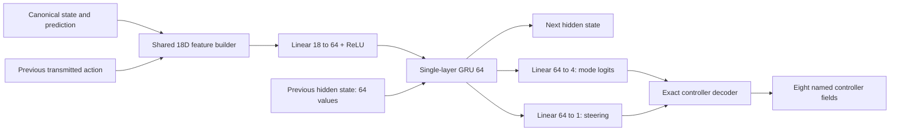

# First student contract: design proposal

Date: 4 October 2026. Scope: contract design only, 1v1. No observation builder, model, dataset generator, BC, simulator adapter, or training implementation was created.

## Status and source basis

The user approved five design directions during this discussion:

1. Match the original teacher's action support.
2. Supply a validated external prediction target.
3. Evaluate a small recurrent candidate.
4. Preserve native delivered-callback timing.
5. Use bounded prediction compatibility tests rather than requiring numerical identity. Acceptance requires measured position/steering errors and a live behavior check; systematic scenario failures remain blockers.

All numerical acceptance thresholds below are proposed engineering gates, not already measured results or individually approved tolerances. Approval of bounded testing does not approve a predictor or authorize implementation. The contract is a candidate to validate before freezing.

Reference behavior is defined by `python-example-original/` revision `fd061f457bf19175b4a9b3b3d7811a987044c64d`: `MyBot.get_output`, `begin_front_flip`, `steer_toward_target`, `Orientation`, `relative_location`, `ControlStep.tick`, `Sequence.tick`, and `find_slice_at_time`.

See [source investigation](python_example_original_investigation_20261004.md) and [live validation](python_example_original_live_validation_20261004.md). Live evidence establishes practical reference acceptance, not predictor parity or learned memory.

## 1. Actions: preserve continuous steering, classify controller combinations

The original returns only four distinct combinations of throttle, pitch, and jump. Steering varies continuously in one of them. Proposed categorical order and exact decoder:

| ID | Mode | Throttle | Steer | Pitch | Jump |
|---:|---|---:|---:|---:|---|
| 0 | Neutral | 0 | 0 | 0 | false |
| 1 | Chase | 1 | clamp(predicted steering, -1, 1) | 0 | false |
| 2 | Jump | 0 | 0 | 0 | true |
| 3 | Front dodge | 0 | 0 | -1 | true |

Yaw and roll are 0; boost and handbrake are false for every mode. `use_item` is false. Transport order is exactly `[throttle, steer, pitch, yaw, roll, jump, boost, handbrake]`.

The release and coast phases share Neutral because their actual controller outputs are identical. The network must remember when to leave Neutral. Modes are action combinations, not private sequence labels, and the decoder contains no speed trigger, phase schedule, or steering rule.

Inference uses categorical argmax, with the lowest mode ID winning a tie. The steering head produces one real value, clipped only as the declared output-bound operation. Non-Chase modes force transmitted steering to zero. No sampling, nearest-row conversion, or button threshold is needed.

Later BC can use categorical cross-entropy plus a Chase-only steering regression loss, such as Huber loss on the raw scalar. Computing regression loss before deployment clipping avoids a zero-gradient region when the prediction overshoots a bound. The first student is deterministic at inference: it returns mode probabilities and a steering estimate, not a full stochastic continuous-action distribution. Future PPO would require a separately reviewed actor/loss contract; the historical 90-action trainer cannot simply be reused.

### Alternatives and costs

- Independent analog/button heads are more general, but can output combinations absent from this teacher, such as throttle during its coast or jump without the intended pitch relationship. They also turn exact teacher constants into unnecessary learning tasks.
- A custom discrete steering grid is possible. With B uniformly spaced steering bins including -1 and +1, nearest-bin error is at most `1/(B-1)`: 0.05 for 21 bins, 0.02 for 51, 0.01 for 101. These are command errors, not guarantees about gameplay. Quantization trades regression for more classes and deliberate loss of precision.
- The old 90-action table is incompatible: steering is only -1/0/+1, some rows introduce yaw or handbrake that the teacher never commands. Do not use it as a shortcut.
- Fixed-zero channels limit future exploration beyond this teacher. That is the approved first imitation scope; adding boost or new maneuvers later requires a versioned contract change.

## 2. Memory: a small GRU rather than a short fixed history

The teacher's nominal flip is 1.10 seconds, but its step timestamps begin on first use, completion is strictly `elapsed > duration`, and a finishing callback still returns the old step's controls. There is no sequence reset at goals, kickoffs, or replays.

No-ball callbacks return Neutral before ticking the sequence. A replay can therefore leave a sequence pending longer than a short history window. Previous action alone is insufficient: release and coast both appear as Neutral, but have different continuations.

| Approach | Benefit | Cost / limitation |
|---|---|---|
| Current-state feedforward | Easiest deployment | Cannot generally distinguish different sequence states with the same current packet |
| Two-second history stack | Explicit, inspectable history; ordinary MLP | At 60 Hz, 120 observations give 2,160 inputs for this 18D design; irregular cadence changes coverage, and older sequence state can fall outside the window |
| Longer time-based history | Better replay coverage | Larger input and storage; interpolation can change button-edge semantics; finite windows still need a policy for older state |
| 64-unit GRU | Constant-size persistent state; naturally consumes ordered observations | Learned memory is approximate, requires sequence-aware BC and reset discipline, and may drift over long pauses |
| Scripted flip scheduler outside the network | Exact timer | Moves a central teacher behavior into hand-coded student logic; not the proposed ML contract |

Recommendation: one unidirectional GRU, one hidden state per controlled bot, explicit elapsed-time input. No teacher private sequence index/timer is supplied to the actor.

Hidden state starts at zero with a fresh controlled-agent lifetime. Preserve it across goals, kickoffs, replays, and ordinary absence of the ball. Update the recurrent network on delivered callbacks, including no-ball callbacks, so the observed clock and absence are available to learned memory. Do not reset at every training chunk or randomly shuffle individual frames.

Previous actions in training would come from the teacher; live inference uses the student's own previously transmitted action. This creates exposure bias: a wrong mode can affect subsequent decisions. Teacher-forced agreement alone will not establish success. A later small BC pilot must compare both teacher-forced and self-fed sequences. Training chunk initialization needs episode-prefix replay or a validated warm-up; no fixed short warm-up is asserted sufficient through replays.

## 3. Candidate observation contract: 18 float32 features

This is a minimum practical candidate for the approved imitation scope, not a proof of the mathematical minimum. Some redundancy is intentional to make distance thresholds and missing data explicit.

Use a canonical raw-state adapter and **one shared feature builder**. Compute local geometry with the exact original forward/right/up convention before casting the completed vector to float32. Local X is forward, Y right, Z up. Retain full 3D distance and speed. No team inversion is required because the reference uses car-local geometry and has no team-specific decision logic.

Let `C` be own position, `B` current ball position, and `P` the selected external predicted position. Local relative components are the dot products of displacement with the original Orientation basis.

| Indices | Feature | Scaling | Missing-value rule |
|---|---|---|---|
| 0–2 | Current ball relative XYZ | divide by 6000 UU | zeros when ball absent |
| 3–5 | Predicted ball relative XYZ | divide by 6000 UU | zeros when prediction invalid or ball absent |
| 6 | Current 3D car-to-ball distance | divide by 6000 UU | zero when ball absent |
| 7 | Own 3D speed | divide by 2300 UU/s | own car must exist |
| 8 | Ball present | 0 or 1 | explicit mask |
| 9 | Valid selected prediction | 0 or 1 | explicit mask |
| 10 | Selected slice time minus current elapsed time | divide by 2 seconds | zero when prediction invalid |
| 11 | First slice time minus current elapsed time | divide by 1/120 second | zero when prediction invalid |
| 12 | Elapsed game time since previous processed callback | divide by 1/60 second | zero on initialization |
| 13–16 | Previously transmitted mode, one-hot in ID order | unchanged | Neutral on initialization |
| 17 | Previously transmitted steering | unchanged | zero on initialization and non-Chase modes |

6000 and 2300 are proposed scale factors, not clipping bounds or promises about maximum distance/speed. Values can exceed 1. No running mean/variance, truncation, silent padding, or clipping of observations. Masks distinguish absent information from a genuine zero. Raw inputs and timestamps remain necessary diagnostic evidence; normalized values alone cannot explain adapter failures.

Feature 11 measures prediction timestamp offset, not transport latency. Receive timestamps can be logged separately. Feature 10 exposes the horizon actually selected by the original helper rather than assuming it is exactly two seconds.

The scalar distance duplicates information in current-ball XYZ to make the strict 1500-UU branch easy to learn and inspect. Z retains full 3D geometry even though steering uses local X/Y. Raw car orientation is consumed by the builder; raw ball velocity/spin, gravity and arena geometry are consumed by the external predictor. Their omission from the neural vector does not mean the complete system can omit them.

Opponent state, boost, ground/jump availability, goals, absolute match time, and match phase are omitted because the teacher does not use them for decisions. This is sufficient information for imitating its source policy given successful temporal learning; it does not claim sufficiency for a stronger tactical 1v1 bot. Opponent collisions still affect observed own/ball state. No teammate information is introduced.

Any loss of relevant distinctions in validation must change the declared feature schema, not be hidden by padding or reordering.

## 4. Prediction representation

Supply the **prospective external prediction point**, transformed into the current car's local frame. Keep current and predicted points separate. Do not supply the already chosen Chase target: the network should learn the distance-dependent choice rather than embedding that branch in the observation builder.

The original helper selects `int((elapsed + 2 - first_slice_time) * 120)`, using Python's truncation semantics and no interpolation. Use the same timestamp/index selection on the same prediction message available to the teacher for that callback. For the student this feature must be computable regardless of whether the teacher happens to be inside its private sequence.

RLBot prediction covers six seconds at 120 Hz and assumes no car collisions. RocketSim exposes prediction APIs, but the installed signatures do not establish equivalent sample offsets, collision exclusion, arena bounces or timestamp semantics. See [official RLBot prediction documentation](https://wiki.rlbot.org/v5/botmaking/ball-path-prediction/) and installed `RocketSim.pyi:Arena.get_ball_prediction/BallPredictor.get_ball_prediction`.

A single point is cheaper and matches what the teacher consumes. Multiple horizons would give richer trajectory shape but introduce information and model complexity this reference does not require. Learning prediction from raw physics would entangle imitation with wall/bounce/spin prediction and is outside the user-approved direction.

An out-of-range slice means invalid prediction; the original falls back to current-ball chasing. An empty prediction can crash the original when its lookup branch is reached. Do not relabel that exception as a successful fallback demonstration. A failed teacher/prediction fixture stops and is reported. A new stale-prediction cutoff would also be a behavior change; measure age first, then explicitly review any cutoff.

If provider parity fails, stop and discuss the smallest fallback: limited live teacher demonstrations using the same live prediction service, or an explicitly approved predictor change with a new live teacher comparison. Do not silently accept different targets.

## 5. Concrete neural architecture

With biases, this architecture has **26,501 trainable parameters**: encoder 1,216, GRU 24,960, heads 325. This is a calculated size, not a demonstrated capacity or latency result.

Float32 weights/state; one layer; unidirectional; no dropout, batch normalization, or optimizer state at inference. Live batch size one. CPU inference is the initial deployment candidate because the model is small; actual latency must be measured in the live environment. Use the installed PyTorch implementation and pin its version rather than upgrading for this proposal. [PyTorch GRU documentation](https://docs.pytorch.org/docs/2.14/generated/torch.nn.GRU.html) describes the recurrent state and tensor shapes; the project's installed `torch/nn/modules/rnn.py` remains the version-specific implementation authority.

64 hidden units are an initial capacity choice, not a proven optimum. A smaller GRU could be sufficient; a larger one could fit timing more easily. Hold this candidate fixed for the first small pilot, then change capacity only against held-out and live evidence. No training is authorized by this design document.

## 6. Simulator/live timing proposal

Approved timing direction: preserve decisions on delivered callbacks and use actual game-time deltas. The live run had 94.91% two-physics-frame gaps, but also gaps of 1–5. Neither configured packet rate nor average wall time defines action repeat.

- Physics base: 120 Hz.
- Simulation initially uses two-tick decision intervals as the nominal case, plus entire recorded interval schedules and explicit gap stress cases. These are separate fixture conditions, not a claim of fixed live repeat 2.
- At decision time t, observe state and currently available prediction, decide once, and hold that controller until the next accepted decision. Do not run imaginary intermediate GRU steps on repeated stale packets.
- Live elapsed time uses `MatchInfo.seconds_elapsed`; wall time only measures latency. Source documentation says the game clock advances during replays/countdowns/pauses too.
- Positive gaps must remain visible in the time feature; duplicate/backward time is a contract violation to investigate, not silently zero or reset.
- A missing controlled car prevents policy evaluation. Identity changes need an explicit fresh-agent initialization, rather than reuse of another car's hidden state.
- No-ball callbacks preserve action neutrality at the output interface, matching the original's early return. This environmental availability gate is explicit; it does not implement flip or steering decisions. The actor's hidden state still updates on those observations.

The installed `RocketSimEngine.step` applies eight controls directly, with a configurable one-tick delay. Its `rlbot_delay=True` is a starting hypothesis, not proof of live latency. Measure the delay and hold behavior before fixing it. Do not compensate both in the scheduler and the engine, which would double the intended delay.

RLGym's ordinary active-play engine does not itself reproduce all live countdown/replay/no-ball transitions. A validated phase/clock adapter is needed for those diagnostic scenarios; training only on active-play resets would leave a known deployment gap.

## 7. Exact validation experiments before a teacher-data pipeline

These are bounded diagnostic experiments to authorize next, not executed work or a permanent dataset generator. Any live/simulation commands will be supplied for the user to run. Source directories stay untouched.

| ID | Experiment | Required checks / proposed gate |
|---|---|---|
| V0 | Complete one isolated live reference run after the diagnostics-reader fix | Agent ready; protected hashes unchanged; no original/diagnostic errors; natural match-end status recorded. Distinguish harness completion from teacher performance. |
| V1 | Action round-trip over all four modes and 1,001 evenly spaced Chase steering values | Decode/encode through RLBot and RocketSim conventions; analog difference at most 1e-6; buttons exact; no yaw/roll/boost/handbrake added; unsupported teacher combinations fail loudly. |
| V2 | Shared observation parity on 1,000 paired canonical states | Include both teams, eight yaw headings, nonzero pitch/roll, wall/upside-down poses, moving balls and missing data. Maximum normalized feature difference 1e-5; masks/mode fields exact. Same declared feature order/dtype; finite values. Preserve identical raw inputs when comparing adapters. |
| V3 | Strict source boundaries | Distances 1499.9/1500/1500.1; speeds 749.9/750/750.1/799.9/800/800.1; nonzero Z; targets behind and on each local axis; simultaneous far-ball and flip-trigger conditions. Original controller branch and eight outputs must match adapted-reference outputs. These are teacher-adapter checks, not a trained network accuracy requirement. |
| V4 | Stateful teacher equivalence under callback schedules | Fresh teacher instances on identical synthetic packets/predictions at gaps 1,2,3,4,5 and the recorded mixed schedules; compare all returned controls, sequence index/done flags and start times. Include exact duration equality and next callback. Expected sequence agreement is exact apart from declared numeric serialization tolerance. |
| V5 | Missing-ball/transition memory fixtures | Interrupt each flip phase for 0.1, 1, 5 and 10 seconds with no-ball callbacks, then resume; also goal, kickoff and replay transitions with/without ball. Verify early-neutral output and the original's next-step behavior, without automatically clearing sequence. Demonstrate identical current observations can require different actions under different past histories. |
| V6 | Prediction indexing and timestamp contract | Numbered synthetic 120 Hz slices, first-sample offsets of 0/1/2 ticks, stale messages, out-of-range request, empty list, and requested times around index boundaries. Reproduce the original selected index/time when valid; preserve/report exception cases separately. Establish RocketSim first-sample and tick_interval semantics empirically. |
| V7 | Cross-provider prediction parity | At least 100 matched ball states: stationary, free flight, rolling, spin, floor/wall/corner bounces, ceiling and goal-mouth paths, with cars near the predicted path. Compare 0.5/1/2-second trajectories for diagnosis; two-second point and induced reference steering are the actual gate. Verify exclusion of hypothetical future car touches. |
| V8 | Action latency and hold behavior | In an isolated transport probe, emit identifiable bounded control changes, log callback frame/clock, send time, subsequent last_input and motion. Measure rather than assume application delay. Compare simulation delay settings and ensure a single compensation location. A last_input echo alone is not proof of physical application time. |
| V9 | Closed-loop adapted-reference checks, no learned policy | Run the unchanged source through the proposed adapter in matched 1v1 controlled scenarios: stationary/moving ball, oblique approach, kickoff, corner, wall and recovery. Compare touches, first-touch times, trajectory and flip events, not only actions. Repeat native/fixed cadence comparisons if fixed timing is selected. No new scripted expert. |
| V10 | Contract integrity review | Confirm previous inputs contain only past transmitted actions; prediction comes from current information, not realized future simulator trajectory; no sequence-state leakage; exact reset/clock/phase semantics; hash reference and pin dependency/schema versions. Approve tolerances and any unresolved predictor/timing discrepancy before collection. |

For V7, proposed initial tolerances are: selected horizon mismatch at most one physics tick; two-second position error at most 50 UU in at least 95% of cases; induced Chase steering difference at most 0.1 in at least 95% of cases. Report each scenario group and every steering-sign disagreement outside a near-zero deadband of ±0.02. A systematic bounce/goal/sign failure blocks approval even if the aggregate percentage passes. These are provisional usefulness gates, not an assertion that the two predictors are exact; review failed cases before accepting a provider. The user selected bounded compatibility testing; exact thresholds remain for review, and a live behavior check is required before provider acceptance.

## 8. What cannot be established before a small BC pilot

Before data collection we can establish representability, adapter equivalence, prediction compatibility and reproducible teacher timing. We cannot prove that untrained GRU weights will learn the hidden timer or remain stable when self-fed.

After a subsequently authorized small BC pilot, mandatory gates include held-out full-sequence agreement, button-edge timing error in seconds/physics ticks, per-mode confusion and phase-duration errors, teacher-forced versus self-fed histories, replay/gap stress tests, numerical/latency checks, varied 1v1 simulation and early live deployment. High overall action agreement can conceal rare but important jump/release errors, so mode-specific and temporal results must be reported.

No contract is frozen on the basis of this proposal alone. The immediate next authorization should be for the bounded compatibility experiments, not a large dataset or training run.
